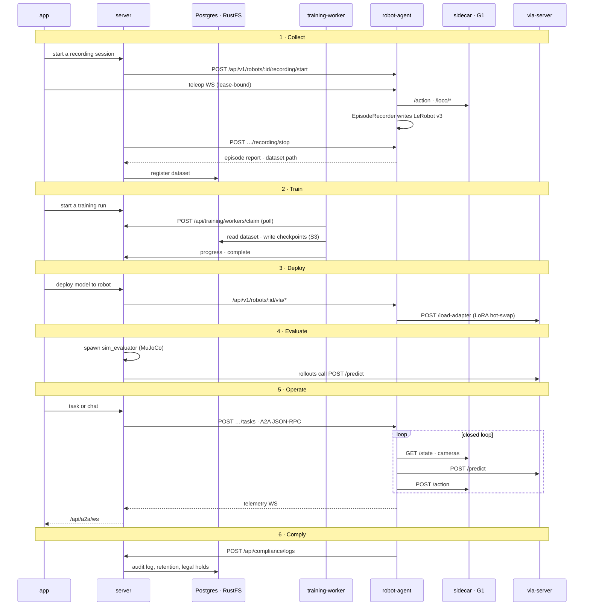

# System Architecture

NeoDEM covers the whole Physical AI lifecycle: Collect → Train → Deploy →
Evaluate → Operate → Comply. The **server** is the system of record and the
orchestrator. There is one **robot-agent** per robot, and it is the only
process that talks to hardware, through a sidecar. Model serving
(**vla-server**) and training (**training-worker**) live in separate repos and
run on a GPU box. Ports, protocols and zones are covered in
[network-architecture.md](network-architecture.md).

[](diagrams/architecture-overview.svg)

> **Interactive:** open [`diagrams/architecture-overview.svg`](diagrams/architecture-overview.svg)
> straight from a checkout in a browser. Click a lifecycle stage to highlight
> its path, and hover a line for details. GitHub shows it as a static image.

## A skill's path through the lifecycle

The numbers match the markers in the diagram.



The server spawns the sim evaluator as a Python subprocess (`evaluate_vla.py
--vla-server`). The server process itself makes no HTTP call to vla-server.

## Services

### App (Frontend)

| | |
|---|---|
| Location | `app/` |
| Stack | React 18, TypeScript, Tailwind CSS, Zustand, Vite |
| Port | 1420 |
| Wrapper | Tauri 2.0 (desktop) |

Feature-first organization: `app/src/features/{name}/`. 21 feature modules including fleet dashboard, robot management, VLA training, A2A chat, compliance logging, and GDPR self-service.

### Server (Backend)

| | |
|---|---|
| Location | `server/` |
| Stack | Node.js, Express, Prisma ORM, TypeScript |
| Port | 3001 |
| Database | SQLite (dev: `server/prisma/dev.db`), PostgreSQL (production) |
| Auth | JWT with MFA (TOTP). Disabled in dev via `AUTH_DISABLED=true` |

Architecture: Routes -> Services -> Repositories. 37 route files, 45 services, 18 repositories, 73 Prisma models.

Key endpoints:
- `GET /health` — health check
- `GET /.well-known/a2a/agent_card.json` — A2A discovery
- `/api/auth/*` — authentication (register, login, MFA)
- `/api/robots/*` — robot management
- `/api/a2a/*` — A2A conversations, messages, tasks
- `/api/training/*` — VLA training jobs
- `/api/datasets/*` — dataset management
- `/api/deployments/*` — VLA model deployment
- `ws://localhost:3001/api/a2a/ws` — WebSocket for real-time events

See [api.md](api.md) for the full endpoint list.

### Robot Agent

| | |
|---|---|
| Location | `robot-agent/` |
| Stack | Node.js, Genkit (Gemini 2.5 Flash), A2A SDK |
| Port | 41243 (default and SO-101); the G1 EDU sim profile uses 41245, the G1 EDU agent profile 41246 |
| Config | `.env.<profile>`, from the `.env.*.example` files |

AI-powered agent that interprets natural language commands, manages robot state, and orchestrates VLA inference. Persists state to `robot-agent/data/state.json` on shutdown.

Key endpoints:
- `GET /.well-known/agent-card.json` — A2A agent card
- `/api/v1/robots/:id/*` — telemetry, commands, tasks, safety, VLA control
- `/api/v1/health` — health check
- `ws://localhost:41243/ws/telemetry/:robotId` — telemetry stream (the server dials it)
- `ws://localhost:41243/ws/keyboard-teleop` — keyboard, gamepad and VR teleop, bound to a control lease
- `ws://localhost:41243/ws/bilateral-teleop` — ALOHA-style teleoperation

### Hardware Sidecar

| | |
|---|---|
| Location | `robot-agent/hardware/so101_sidecar.py` |
| Stack | Python, BaseHTTPRequestHandler |
| Port | 8765 |

Lightweight HTTP bridge between the Node.js agent and the SO-101 arm hardware. Manages serial port access with on-demand connection and 5-second idle timeout (releases `/dev/ttyACM0` for other tools like LeRobot CLI).

Key endpoints:
- `GET /health` — connection status
- `GET /state` — current joint positions
- `POST /action` — send joint commands
- `POST /vla/start` — start VLA control loop
- `POST /vla/stop` — stop VLA control
- `GET /vla/status` — VLA runner status
- `GET /safety/status` — safety metrics

### VLA Server (Inference) — Separate Repository

| | |
|---|---|
| Location | Extracted to separate `vla-server` repo (see `../vla-server/`) |
| Stack | Python, FastAPI, Uvicorn |
| Port | 8000 |
| Models | SmolVLA (active), GR00T N1 (ZMQ), pi0.5 (stub) |

Runs on a separate machine (Mac with Apple Silicon for SmolVLA, or NVIDIA GPU for GR00T). Provides a unified HTTP inference API for multiple VLA model backends.

Key endpoints:
- `GET /health` — model load status
- `GET /config` — model metadata (action_dim, cameras, chunk_size)
- `POST /predict` — run inference (images + state + instruction -> actions)
- `POST /reset` — reset model state between episodes

## Site Map

A robot is bound to one site, a digital twin (`Robot.twinId`). The twin's zones
(`TwinZone`) are the only zone model: each is a uniquely named place or a
keepout. The Fleet page's Map tab and the dashboard draw a **site map**
(`app/src/features/fleet/components/SiteMap.tsx`): pick a twin, see it top-down
with its zones and the live robots bound to it, and E-stop a zone from the map.
A robot's position is `location.place`, the place it is in, and only robots
whose frame is aligned with the twin are plotted. The agent fetches its site's
places from `GET /api/robots/:id/places` (TASK-274).

A simulated robot's world is the twin's frame by construction. A real robot's
odometry starts wherever the sidecar came up, so an operator aligns it to its
site from the Robots tab (TASK-325). The server stores that odom → twin
transform per robot (`RobotFrameRegistration`, `PUT`/`GET`/`DELETE
/api/robots/:id/frame-registration`). The agent polls it, carries the place
graph into odometry, and fences, names places and walks in that frame. A
re-zeroed odometry (new sidecar boot id) invalidates the registration, and the
agent fails closed until the robot is aligned again.

## Communication Protocols

| Path | Protocol | Purpose |
|------|----------|---------|
| App ↔ Server | REST `/api/*` + WebSocket `/api/a2a/ws` | UI operations, live events |
| App → Agent | WebSocket `/ws/keyboard-teleop` | Teleop, bound to a server-granted control lease |
| Server → Agent | HTTP `/api/v1/*`, A2A JSON-RPC, telemetry WS | Registration, health, heartbeat, tasks, conversations |
| Agent → Server | HTTP `/api/*` with a service token | Compliance logs, events |
| Agent → Sidecar | HTTP | Hardware control, `/loco/*`, cameras |
| Sidecar ↔ G1 | Unitree DDS · ZMQ | `rt/api/sport/*` loco RPC, lowstate via the state bridge |
| Agent → VLA Server | HTTP `/predict`, `/load-adapter` | Closed-loop inference, adapter hot-swap |
| VLA Server → GR00T | ZMQ `:5555` | GR00T backend |

Every port, the cadence of each call, the auth on each hop and the
differences between dev, compose and Helm are listed in
[network-architecture.md](network-architecture.md).

## Agent Mode

A toggleable mode in which a **local Ollama LLM** turns plain language ("geh zum Tisch
mit dem Hut") into a list of executable **blocks** and runs them over the Unitree
**LocoClient** — the same call path in simulation and on a real G1 EDU.

```
chat / voice ──► A2A message ──► planner (Ollama) ──► block list
                                      ▲                   │
                          scene memory │                   ▼
                                   vision (VLM) ◄── block executor ──► LocoClient
                                       ▲                                    │
                                  head camera                        ┌──────┴───────┐
                                                                     ▼              ▼
                                                              real G1 (FSM)   sim_g1_dds
```

**Blocks**: `walk`, `turn`, `goto`, `look`, `scan_room`, `wave`, `greet`, `posture`,
`speak`, `wait`, `vla_skill`, plus the runner-owned kinds the planner may never emit —
`patrol`, `capture`, `inspect` (patrol, TASK-212) and `tour`, `present`, `demo` (host mode,
TASK-213). `walk`/`turn`/`goto` become `SetVelocity` (api 7105) with a duration;
`wave`/`greet` become arm tasks (7106); `posture` becomes `SetFsmId` (7101). `look` and
`scan_room` take no robot action — they capture a head-camera frame and send it to the
vision model.

`vla_skill` is the one block that does not become a LocoClient call: it hands the named skill
to the VLA runner and waits, so a plan can pick and place rather than only move. It was
deliberately held out of v1 and landed with TASK-226; the authoritative list is
`AgentBlockKinds` in `robot-agent/src/agent-mode/types.ts`.

**Planning** is re-entrant: the planner emits a full block list, and after each block it
may rewrite only the *remaining* plan. Completed blocks are frozen. A running block is
never interrupted mid-flight; the stop word bypasses the LLM entirely.

**Two models, two roles.** `AGENT_VISION_MODEL` sees pixels and returns text;
`AGENT_PLANNER_MODEL` sees only that text and the scene memory. Both default to
`gemma3:4b` on the local Ollama endpoint.

**Scene memory** is in-memory only: an entity list (`label`, world bearing, distance
estimate, confidence, last seen) plus a free-text "current view", dumpable as Markdown.
Plans are ephemeral too — no Prisma model, no migration, no `SkillChain` reuse. State is
mirrored robot-agent → server (in memory, last plan per robot) → app over the existing
`/api/a2a/ws` as `agent:*` events, and every finished block is written to the audit log.

**People** are handled statelessly: the VLM is only ever asked whether a person is in
frame and roughly where. No faces, no identities, no image retention.

**Arbitration.** A `controlOwner` (`idle | teleop | vla | agent`) is exclusive. Human
teleop preempts the agent and discards the running plan.

**Two use cases sit on top of it.** *Patrol* (TASK-212) is the robot alone: an
operator-defined route walked on a schedule, a control photo at every checkpoint,
compared against a baseline of normal. *Host mode* (TASK-213) is its mirror image —
the robot with a member of the public in front of it: it greets them, states that it
is an AI (EU AI Act Art. 50, in force since 2 August 2026), offers a guided tour,
walks them to authored stops, and answers questions ONLY from facts an operator
wrote — recording "I do not know" as a first-class outcome rather than inventing an
answer. Both are one Agent Mode plan driven by a runner rather than by the planner,
so E-Stop, geofence, arbitration and the audit log apply to a tour stop exactly as
to an operator's `goto`. Host mode stores no images and no audio at all, and infers
no age, gender or emotion — emotion recognition in a workplace is prohibited, not
merely discouraged. The operator's guide to all of this is [`agent-mode.md`](agent-mode.md);
`robot-agent/AGENTS.md` has the developer detail for both.

> **Safety deviation — read before pointing this at hardware.** Agent Mode ships with a
> **manual E-Stop only** — three triggers, all manual: the UI button on `/agent`, a spoken
> stop word (which bypasses the LLM entirely), and SPACE/ESC in the terminal running the
> robot-agent (`src/terminal-estop.ts`; no-ops when stdin is not a TTY). It deliberately does
> **not** have the arming gate, dry-run default, connection watchdog or delta clamping that
> `robot-agent/hardware/real_g1_bridge/README.md` defines as the house standard. This was
> an explicit product decision (TASK-194). Consequence: the first real-hardware run needs a
> spotter on the physical E-Stop and a hand-set velocity cap.

### Simulation

`robot-agent/hardware/sim_g1_dds/` is a MuJoCo node that is indistinguishable on the wire
from a real G1: it subscribes `rt/arm_sdk` and `rt/dex3/*/cmd`, publishes `rt/lowstate`,
`rt/dex3/*/state` and `rt/odommodestate`, and **serves the `sport` RPC service** on
`rt/api/sport/{request,response}`. `LocoClient` is not onboard-only — it is RPC over
ordinary DDS, and the SDK ships the server stub, so we answer it ourselves.

The scene is `g1_dex3_room_scene.xml` (~6×6 m room, table with a hat, chair, shelf,
doorway, person figure). The pelvis has x/y/yaw position actuators driven from the
integrated loco velocity; the legs stay in the stand pose. **There is no gait in v1** —
what matters is that the head camera genuinely moves, so `look` returns different images
from different places. A real gait policy is a follow-up.

## Hardware

### SO-101 Robot Arm
- 6 DOF: shoulder_pan, shoulder_lift, elbow_flex, wrist_flex, wrist_roll, gripper
- Serial port: `/dev/ttyACM0`
- Power: AC (no battery, `batteryLevel: null`)
- Max payload: 0.5 kg

### Cameras
- **Front camera** (cam 0): IMX477 (CSI), used for VLA inference
- **Wrist camera** (cam 1): OV5647 (CSI), optional for VLA inference
- Capture: 640x480, resized to 224x224 for inference

## Database

SQLite for development (`server/prisma/dev.db`), PostgreSQL for production. Prisma ORM with 73 models. Array fields stored as JSON strings in SQLite.

```bash
cd server
npm run db:generate   # Generate Prisma client
npm run db:push       # Push schema to dev database
npm run db:migrate    # Run migrations (production)
npm run db:studio     # Open Prisma Studio GUI
```

## Systemd Services

On the SO-101 bootstrap rig, a Raspberry Pi, all four services run as systemd units:

| Unit | Working Directory | After |
|------|-------------------|-------|
| `neodem-server` | `server/` | network.target |
| `neodem-app` | `app/` | network.target |
| `so101-sidecar` | — | — |
| `neodem-agent` | `robot-agent/` | neodem-server, so101-sidecar |

```bash
sudo systemctl status neodem-server neodem-agent neodem-app so101-sidecar
journalctl -u neodem-agent -f --no-pager
```

## Optional Infrastructure

These are configured but not required for local development:

| Service | Purpose | Status |
|---------|---------|--------|
| NATS (4222) | Async job queues, KV stores | Optional, logs warning if unavailable |
| RustFS/S3 (9000) | Object storage for models/datasets | Optional |

**Model registry**: Prisma `ModelVersion` table (one row per trained adapter, linked to `TrainingJob` + holding `artifactUri` pointing at RustFS). No MLflow — see TASK-142.
