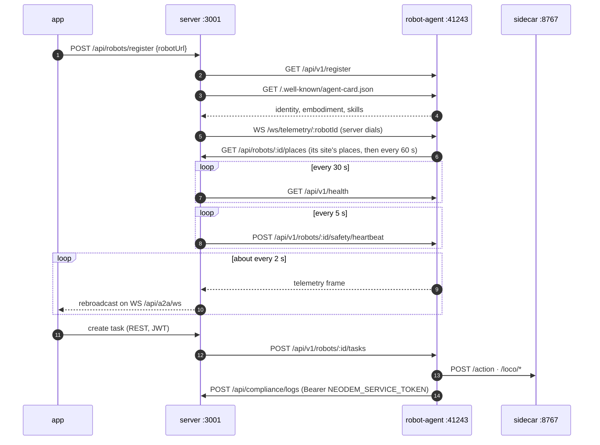
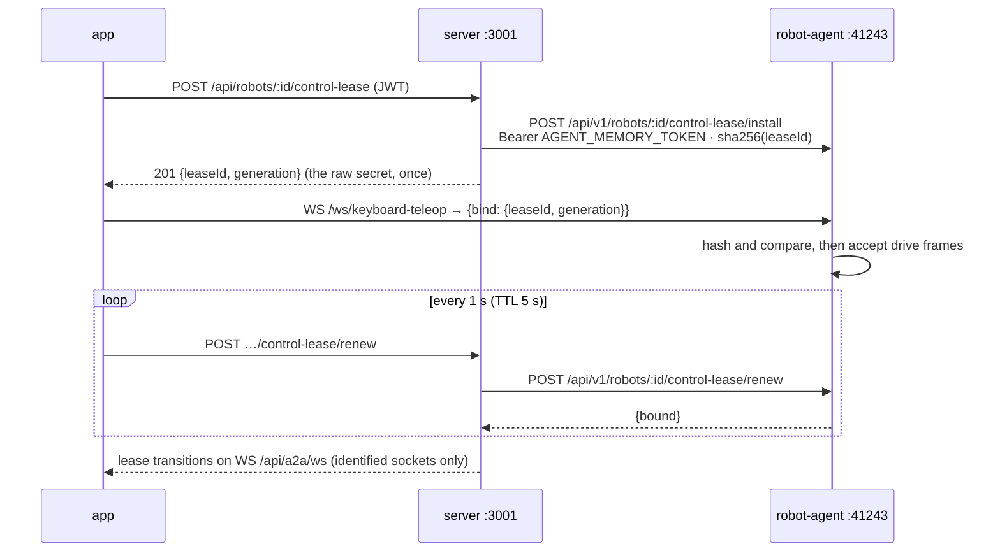

# Network Architecture

Where each NeoDEM process runs, which port it listens on, and which side opens
each connection. For what the parts do, see [architecture.md](architecture.md).
For deploying them, see [deployment.md](deployment.md).

> **Interactive:** open [`diagrams/network-architecture.svg`](diagrams/network-architecture.svg)
> straight from a checkout in a browser. Click a box to see only its links, and
> hover a line for its paths, auth and cadence. GitHub shows the SVG as a static
> image because it strips scripts. The picture follows your light or dark mode.

Every arrow points away from the side that opens the connection. That matters
for firewalls. **The server dials the robot** for almost everything, including
the telemetry WebSocket. The robot dials the server only to report compliance
logs and events. The one exception is teleop, which goes from the browser
straight to the agent.

## Zones

| Zone | What runs there | How it is reached |
| ---- | --------------- | ----------------- |
| **Operator** | Browser or Tauri app, Quest 3 (WebXR), `roboctl` | — |
| **Cluster** (Helm or compose) | ingress, app nginx `:8080`, server `:3001`, Postgres, NATS, RustFS | HTTPS through the ingress. Every Service is ClusterIP. |
| **Robot edge** (one LAN per robot) | robot-agent `:41243`, sidecars, state bridge on PC2, the G1 | The server and teleop clients dial `:41243` |
| **GPU box** (separate repos) | vla-server `:8000`, GR00T policy, training-worker, twin-builder, Ollama | The agent dials vla-server. Workers poll the server. |
| **Internet** | Gemini, OpenRouter, Hugging Face Hub, GHCR | Egress on 443 |

## How a robot joins and stays connected

Registration is **pull-based**. An operator gives the server the agent's URL,
and the server fetches the agent's identity. After that the server holds two
timers and one socket per robot.

The agent calls `/api/robots/register` itself only when a sidecar attaches or
detaches. The server then pulls the new identity.

## Teleop and the control lease

Teleop sockets go from the browser straight to the agent. The keyboard,
gamepad and VR clients all use `ws://<agent>:41243/ws/keyboard-teleop`. The
server still decides who may drive, through a **control lease**: one row per
robot in the database, written with conditional updates so that it holds
across server replicas. The agent only ever sees a hash of the lease secret.

The agent rejects an unbound socket with `lease_required` or `lease_invalid`.
Its REST motion routes answer `409 control_lease_held` when enforcement is on.
If the server cannot reach the agent, it treats the lease as `unconfirmed` and
fails closed.

## Port reference

Each row is one connection, listed from the side that opens it.

| From → to | Protocol | Port · path | Auth · cadence |
| --------- | -------- | ----------- | -------------- |
| **Operator** | | | |
| app → server | HTTP REST | `:3001 /api/*` | JWT, off in dev (`AUTH_DISABLED`) |
| app → server | WebSocket | `:3001 /api/a2a/ws` | optional identity via `?token=` or an `{type:'auth'}` frame |
| app · Quest 3 → agent | WebSocket | `:41243 /ws/keyboard-teleop` | bound to a control lease |
| app → agent | WebSocket | `:41243 /ws/bilateral-teleop` | same bind protocol |
| app → SO-101 sidecar | WebSocket | `:8766 /ws/keyboard-teleop` | gamepad, only when leases are off |
| roboctl → agent | HTTP + WS | `:41243 /api/v1/*` | one agent, no server |
| **Server ↔ robot** | | | |
| server → agent | HTTP | `/api/v1/register`, `/.well-known/agent-card.json` | on registration |
| server → agent | HTTP | `/api/v1/health` | every 30 s |
| server → agent | HTTP | `/api/v1/robots/:id/safety/heartbeat`, `/safety/estop` | every 5 s |
| server → agent | HTTP | `/api/v1/robots/:id/tasks` | push-model task distribution |
| server → agent | HTTP | `/api/v1/robots/:id/recording/*` | start, steer and stop episode recording |
| server → agent | HTTP | `/api/v1/robots/:id/control-lease/*` | Bearer `AGENT_MEMORY_TOKEN` |
| server → agent | A2A JSON-RPC | `:41243 /` | natural-language conversations |
| server → agent | WebSocket (server dials) | `/ws/telemetry/:robotId` | about every 2 s |
| server → agent | HTTP proxy | `/api/v1/robots/:id/{camera,vla,skills,agent-mode,map}/*` | camera MJPEG, model switch, eval runs |
| agent → server | HTTP REST | `:3001 /api/compliance/*`, events, peers | Bearer `NEODEM_SERVICE_TOKEN` |
| agent → server | HTTP | `:3001 /api/robots/:id/places` | the bound site's place graph (a twin's named zones), at boot and every 60 s; `404 robot has no site` when unbound. Bearer `NEODEM_SERVICE_TOKEN` |
| **Data plane** | | | |
| server → Postgres | Postgres wire | `:5432` | `DATABASE_URL`, SQLite file in local dev |
| server → NATS | NATS JetStream | `:4222` (monitor `:8222`) | `jobs.training.>`, `jobs.dataset.>`, `synthetic.jobs.>`, KV |
| server · workers → RustFS | S3 over HTTP | `:9000` (console `:9001`) | 8 buckets |
| workers → server | HTTP poll | `/api/training/workers/*`, `/api/twin/workers/*` | Bearer `WORKER_API_TOKEN` |
| Prometheus → server | HTTP | `:3001 /metrics` | no auth |
| **Robot edge** | | | |
| agent → g1_sidecar | HTTP | `:8767 /state /action /estop /cameras/* /record/* /loco/*` | `G1_READ_ONLY=1` and `G1_LOCO_ENABLED=0` by default |
| agent → sim facade | HTTP | `:8777` (second sim `:8778`) | same contract as the sidecar |
| agent → SO-101 sidecar | HTTP | `:8765` | bootstrap arm |
| agent · server → voice | HTTP | `:8768 /say`, `/voices` | Agent Mode narration, voice packs |
| g1_sidecar → state bridge | ZMQ SUB | `tcp://<robot>:6001` | lowstate, hands, battery, odometry |
| g1_sidecar → G1 | Unitree DDS | domain 0, `rt/api/sport/*`, `rt/utlidar/*` | loco RPC, odometry, LiDAR |
| g1_sidecar → G1 PC2 | ZMQ · TCP | `:60000` (teleimager) · `:5600` | head cameras |
| G1 → voice | UDP multicast | `239.168.123.161:5555` | microphone |
| **Inference and egress** | | | |
| agent → vla-server | HTTP JSON | `:8000 /predict /reset /config /load-adapter` | `VLA_SERVER_URL` |
| vla-server → GR00T policy | ZMQ | `:5555` | GR00T backend only |
| agent · server → Ollama | HTTP (OpenAI-compatible) | `:11434 /v1`, `/api/chat` | Agent Mode planner, or `LLM_PROVIDER=ollama` |
| server · agent → cloud | HTTPS | `:443` | Gemini, OpenRouter, HF Hub |
| voice → HF Space | HTTPS | `:443` | only when `VOICE_SAAR_SPACE` is set |

### DDS domains

| Domain | Used by |
| ------ | ------- |
| 0 | the real G1 |
| 1 | `sim_g1_dds` (loopback `lo0`) and the Isaac bridges |
| 9 | mocks and tests |

The sidecar speaks the same protocol to every domain, so an unchanged sidecar
can drive the sim or the robot.

## Auth boundaries

| Caller | Credential | Checked by |
| ------ | ---------- | ---------- |
| App, CLIs | JWT (RBAC). `AUTH_DISABLED=true` in dev. | server |
| robot-agent → server | `Bearer NEODEM_SERVICE_TOKEN` (an `ndsa_` service token) | server |
| server → agent's personal-data and lease routes | `Bearer AGENT_MEMORY_TOKEN`. Without it the agent answers loopback callers only. | agent |
| Workers | `Bearer WORKER_API_TOKEN` | server |
| Teleop socket | lease secret in the `bind` frame | agent, against the hash the server installed |
| Unauthenticated | `/metrics`, `/.well-known/a2a`, `/api/config`, `/api/auth/*` | — |

## Dev, compose and Helm

| | Local dev | docker compose | Helm |
| - | --------- | -------------- | ---- |
| App entry | vite `:1420`, proxies `/api` and WS to `:3001` | nginx `:8080`, published as `:80` | ingress → app Service `:80` → `:8080` |
| API entry | `:3001` direct or through the vite proxy | `:3001` published | combined ingress (`/api`, `/.well-known`) or app nginx `/api` proxy |
| Database | SQLite `file:./dev.db` | `postgres:16-alpine` `:5432` | StatefulSet or external Postgres |
| NATS, RustFS | optional, off | published `:4222/:8222`, `:9000/:9001` | StatefulSets, ClusterIP |
| robot-agent | `:41243`. The G1 EDU sim profiles use `:41245/:41246`. | `:41243`, `PUBLIC_URL=http://robot-agent:41243` | ClusterIP `:41243` |
| vla-server, workers | separate repos, on the GPU box | not in compose | `vlaInference` off by default |

## Known gaps

Found on 2026-09-30 while checking every port against the code. None of them
is fixed yet.

- **Helm NetworkPolicy isolates the server from robots.** Server egress allows
  only Postgres, NATS, RustFS and DNS, which blocks health, heartbeats, tasks,
  A2A and the control-lease calls to `:41243`. Agent ingress admits only the
  server, which blocks direct browser teleop. See
  `helm/neodem/templates/networkpolicy.yaml`.
- **The Helm app policy opens TCP 80, but nginx listens on 8080.**
- **The Helm robot-agent deployment is missing three settings:**
  `PUBLIC_URL`, `NEODEM_SERVICE_TOKEN` and `AGENT_MEMORY_TOKEN`. Compose sets
  the first two. Without `AGENT_MEMORY_TOKEN`, lease calls from a server on
  another host are refused.
- **The legacy `/record/*` path is hard-wired to `:8765`**
  (`server/src/services/TeleoperationService.ts`), the SO-101 sidecar. The
  agent-side recorder (`/recording/*`, TASK-215) is not affected.
- **Port 8766 has three owners:** the SO-101 teleop WS, `federated_bridge` and
  the G1 voice adapter. Port 8778 is both the second sim facade and
  `isaac_manip_bridge --serve`.
- **`rustfs-init` creates 4 of the 8 buckets the code uses.** It skips
  `sensor-scans`, `digital-twins`, `incident-clips` and `patrol-photos`.
- **The point cloud hook uses a placeholder host.**
  `app/src/features/robots/hooks/usePointCloudStream.ts` hard-codes
  `wss://api.neodem.io/pointcloud/:id` instead of the agent's `/ws/pointcloud/:id`.
- **Env names and defaults disagree.** `features.ts` gates NATS on `NATS_URL`,
  but the client reads `NATS_SERVERS`. `.env.example` sets
  `FEDERATED_BRIDGE_PORT=41244`, but the code defaults to 8766.
- **The gRPC VLA client is unused.** `protos/vla_inference.proto` and
  `VLA_INFERENCE_HOST/PORT` are parsed and never called. Inference is plain HTTP
  through `VLA_SERVER_URL`.
