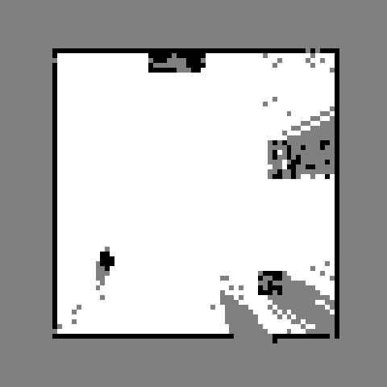

# sim_g1_dds — the G1 EDU + Dex3 simulator that speaks Unitree's wire protocol

A MuJoCo sim node that is indistinguishable, on the wire, from a real Unitree
G1 EDU. Unmodified `unitree_sdk2py` scripts — including Unitree's own
`g1_arm5_sdk_dds_example.py` and `g1_loco_client_example.py` — drive it.

Built for Agent Mode (TASK-194) so the planner speaks **one** API, `LocoClient`,
in simulation and on hardware. Only the DDS peer changes.

| File | What |
|---|---|
| `joints.py` | SDK motor index → MJCF actuator/joint name tables |
| `loco_state.py` | Pure state machine: pose integration, FSM gating, arm gestures. No DDS, no MuJoCo — unit-testable on its own |
| `loco_service.py` | Serves the `sport` RPC service on `rt/api/sport/{request,response}` |
| `sim_node.py` | MuJoCo + DDS peer + optional sidecar-compatible HTTP facade |
| `test_loco_state.py` | pytest for the state machine |
| `test_lidar.py` | pytest for the ray LiDAR: range gates, table-front range against the MJCF, no self-hits |
| `test_snapshot_options.py` | pytest for the snapshot render options (`?shadows=0` &c., no leak into the shared scene) and the 43 joints `/state` reports |
| `e2e_loco_check.py` | Integration check: drives the sim with a real `LocoClient` and asserts the physics |
| `cine_recorder.py` | Cinematic MP4 recording (follow / orbit / wide / any MJCF camera) → ffmpeg; `--record` flag and `/record/*` routes |
| `demo_clip.py` | One Agent Mode command → captioned explainer clip (records, runs the plan, burns block captions) |

## Topics

| Direction | Topic | Type |
|---|---|---|
| in | `rt/arm_sdk` | `LowCmd_` (`motor_cmd[29].q` = 0..1 blend weight) |
| in | `rt/dex3/{left,right}/cmd` | `HandCmd_` |
| out | `rt/lowstate` | `LowState_` |
| out | `rt/dex3/{left,right}/state` | `HandState_` |
| out | `rt/odommodestate` | `SportModeState_` (measured base pose) |
| rpc | `rt/api/sport/{request,response}` | api ids 7001–7005, 7101–7107, 7110/7111 |

DDS domains by convention: **0 = real robot, 1 = sim, 9 = mock/tests.**

## Running

```bash
export CYCLONEDDS_HOME=<your cyclonedds install prefix>

# headless, with the HTTP facade the robot-agent can point at
python sim_node.py --domain 1 --http-port 8777

# live window (macOS needs mjpython — see gotcha 3)
mjpython sim_node.py --domain 1 --viewer
```

Then point the robot-agent at it:

```bash
HARDWARE_SIDECAR_URL=http://localhost:8777 npm run dev:g1-edu
```

Port convention: **8777 = this sim's facade** (also the `e2e_loco_check.py`
default and what `.env.g1-edu-agent.example` points at); 8767 belongs to the
real robot's `g1_sidecar.py`. Keeping them distinct means a mis-pointed
`HARDWARE_SIDECAR_URL` fails loudly instead of quietly driving the wrong target.

The facade serves `/health`, `/cameras`, `/cameras/<name>/snapshot`, `/state`,
`/loco/*` and `/pointcloud/*` (see below). Its `/loco/*` routes deliberately go
**out through a real `LocoClient` over DDS and back in through our own service**
rather than poking the state machine directly — otherwise the demo would prove
nothing about the wire.

`/health` carries a `boot_id` (one `uuid4` hex per process, same key as
`g1_sidecar.py`). The base pose — and so `/loco/odom` — starts from the origin
every time the node starts, so anything the agent built in the odometry frame is
only valid within one boot. The robot-agent keys its persisted occupancy map
(TASK-206) on this id and throws the map away when it changes.

## Camera snapshots

`GET /cameras/<name>/snapshot` renders one frame from the named MJCF camera. It
takes four optional query parameters, each defaulting to what the route has
always done:

| Parameter | Default | What |
|---|---|---|
| `shadows=0` | on | drop MuJoCo's shadow pass |
| `reflection=0` | on | drop the floor mirror |
| `quality=NN` | 85 | JPEG quality, 1..100 |
| `format=raw` | base64 | answer `image/jpeg` bytes instead of base64-in-JSON |

Measured on `g1_dex3_house_scene.xml` at 640x480, request in to bytes out, on an
Apple Silicon laptop:

| Request | ms/frame | fps | payload |
|---|---|---|---|
| default | 48–54 | 19–21 | 93 KB |
| `?shadows=0&reflection=0&format=raw` | 8–12 | 84–127 | 29 KB |

**Read the ratio, not the milliseconds.** Four measurement runs on this machine
put the default between 48 and 54 ms and the cheap form between 7.9 and 12 ms —
the absolute numbers move with whatever else the box is doing (the shadowed form
is the noisy half; the cheap one is stable to a millisecond), while the ratio
stays between 4.5x and 8x. The offscreen render is most of it: 37.7 ms shadowed
and 4.9 ms flat on an idle machine, 66.7 and 8.2 on a busy one.

The render cost is **flat in resolution** — 160x120 measures the same as 640x480,
on every run — so the lighting is the only lever there is. Six lights, each
costing a pass over 187 geoms; asking for a smaller camera buys nothing.

Defaults are unchanged on purpose: the MJPEG stream and Agent Mode's `look` still
get the lit picture, and only a caller that asks for the cheap one pays with it.
The episode recorder (TASK-215) asks: at 30 Hz a ~50 ms frame cannot be delivered
at all, and the picture it is filming is training data rather than a demo video.

One trap for whoever adds the next parameter: `do_GET` used to route on
`self.path` whole, so **any** query string fell through to the 404 rather than
being served with the option ignored. It now splits the path off first.

## `/state` reports the hands, and the sim clock

`GET /state` and `/state/fast` list **43 joints**: the 29 body joints first, then
the 14 Dex3 finger joints (7 per hand), in the same order `/action` has always
accepted them. The fingers used not to be reported at all — and
`HardwareClient.getStateNow()` maps the reply **by name** into the embodiment's
joint order and fills anything absent with `0.0`, so on a `g1_edu` every finger
read back as fully open no matter where it really was. A recorded demonstration
with a constant zero column for both hands is worse than one with no hand column.

The reply also carries `sim_time` (MuJoCo's `data.time`) alongside the existing
wall-clock `timestamp`. The two diverge whenever the loop catches up after a
render, and a recorder that needs to know its frames really are 1/fps apart *in
the world it filmed* wants the second one. `timestamp` stays wall time — that is
the sidecar contract, and the real `g1_sidecar.py` has no other clock to offer.

## Point-cloud routes (ray LiDAR)

The sim has no MID-360, so it stands one in: a fan of `mj_ray`s cast from the
head-camera mount against the loaded MJCF, served under the **same sensor name
the sidecar uses**, `mid360_lidar`. This is what the robot-agent's Agent Mode
range sensing (`src/agent-mode/range.ts`) and the TASK-206 occupancy map consume,
against sim and robot alike, with no branching. It is a *measurement of the
scene*, not a model of a room: an obstacle that is not in the MJCF produces no
return, and a missing return means **unknown**, never "clear".

| Route | Answer |
|---|---|
| `GET /pointcloud/sensors` | `{"sensors": ["mid360_lidar"]}` — only the LiDAR; no depth camera is advertised because the scenes have no depth-cloud source, and an empty cloud for a sensor that does not exist would read as "nothing in the way" |
| `GET /pointcloud/<name>/snapshot` | one fresh sweep (below); unknown `<name>` → `200 {"ok": false, "error": "no depth sensor '<name>'"}`, verbatim the sidecar's wording |
| `POST /pointcloud/lidar/switch` | body `{"on": true\|false}` (else 400). **Accepted and ignored** — the ray LiDAR is always on and the snapshot casts regardless of this flag; the reply says so in `note`. Exists so a client that switches the real MID-360 on before reading works unchanged |

Snapshot JSON, `200`:

```jsonc
{
  "ok": true,
  "sensor": "mid360_lidar",
  "sensor_type": "lidar",
  "has_intensity": false,       // the cast measures geometry, not reflectivity
  "positions": [x, y, z, ...],  // flat XYZ triplets, metres, base_link: x forward,
                                //   y left, z up, floor at z = 0 (PointCloudFrame contract)
  "intensities": [],
  "origin": [x, y, z],          // sensor origin in base_link (~ [0.076, 0, 1.271] at rest)
  "source": "sim-ray",
  // beyond the sidecar's contract, ignored by clients that don't know it:
  "point_count": 5718,          // len(positions) / 3 (robot at the origin, defaults)
  "rays": 5760,                 // rays cast = azimuth_rays * elevation_rings
  "returns": 5732,              // rays that hit anything, in range or not
  "dropped_near": 0,            // returns < min_range_m (self-return gate)
  "dropped_far": 14,            // returns > max_range_m (e.g. floor plane out through the door)
  "decimated": false,           // true if uniformly strided down to LIDAR_MAX_POINTS
  "method": "mj_multiRay",      // or "mj_ray" on bindings without the batch call
  "origin_source": "site:head_camera_site",  // or "base+offset(...)" if the scene has no site
  "self_filter": "geom groups [2, 3] (used only by the 'pelvis' tree)",
  "sim_time": 12.345,
  "fan": {"azimuth_rays": 180, "elevation_rings": 32, "elevation_deg": [-52.0, 7.0],
          "min_range_m": 0.35, "max_range_m": 25.0},
  "scene": "g1_dex3_room_scene.xml"
}
```

`503 {"ok": false, "error": ...}` means **no LiDAR frame** — the cast failed or
timed out (physics loop not running). It is deliberately *not* an empty cloud:
an empty `positions` is indistinguishable from "the sweep found nothing", i.e.
"the way is clear", so a broken sensor fails loudly at the HTTP layer instead.
Note the asymmetry with an unknown sensor name, which is `200` + `ok:false`
(mirroring the sidecar).

Geometry constants (`sim_node.py`, `LIDAR_*` — the reasoning behind each number
is in the comments there):

| Constant | Value | Why |
|---|---|---|
| `LIDAR_SENSOR` | `mid360_lidar` | the sidecar's name for the real sensor |
| `LIDAR_SITE` | `head_camera_site` | ray origin, on `torso_link`; falls back to base + `LIDAR_FALLBACK_OFFSET` = (0.076, 0, 1.271) m and says so in `origin_source` |
| `LIDAR_AZIMUTH_RAYS` | 180 | 2° steps over 360° |
| `LIDAR_ELEVATION_RINGS` | 32 | measured: fewer rings let `range.ts` (≥ 6 returns in the 0.15–1.8 m band) miss the table top and answer the wall behind it |
| `LIDAR_ELEV_MIN_DEG` / `MAX_DEG` | −52° / +7° | the real inverted MID-360's effective vertical fan on the G1 — including its blind spot at head height |
| `LIDAR_MIN_RANGE` | 0.35 m | self-return gate, same as the sidecar's (0.3 m) but a little wider because the origin sits inside the torso shell |
| `LIDAR_MAX_RANGE` | 25 m | over-range = no return; needed because MuJoCo's floor `plane` is infinite |
| `LIDAR_MAX_POINTS` | 20000 | same cap as `G1_POINTCLOUD_MAX_POINTS`; uniform stride, never truncation |

The fan is level (rotated by base yaw only, torso pitch/roll not applied), which
matches what a consumer receives from the robot after the sidecar gravity-aligns
its cloud. The robot's own geoms are masked out of the cast by geom group
(derived per scene, reported in `self_filter`) because the origin sits inside the
torso mesh; the price is that the sim will not show the robot's own arms the way
the real sensor does — code that picks "the nearest surface" out of a real cloud
still has to reject returns inside the robot's own footprint. `test_lidar.py`
pins all of this against the room scene's MJCF.

## Recording clips (demo / social videos)

The sim can render a cinematic camera to MP4 on the physics thread while
everything else (DDS, Agent Mode) runs as normal. No GPU needed — MuJoCo's
offscreen renderer on the M-series CPU/GPU keeps up with 1080×1920 @ 30 fps.

```bash
# whole session, from start-up
python sim_node.py --domain 1 --http-port 8777 --record session.mp4 --record-cam follow

# per clip, over the facade (what demo_clip.py uses)
curl -X POST localhost:8777/record/start -d '{"path":"clip.mp4","cam":"orbit","size":"1080x1920"}'
curl -X POST localhost:8777/record/stop
curl localhost:8777/record            # status
```

Camera modes: `follow` (chase cam behind the robot, smoothed), `orbit` (slow
orbit, beauty shot), `wide` (fixed establishing shot of the room), or any MJCF
camera name (`head_camera` = the robot's own POV).

`demo_clip.py` scripts a whole explainer clip: it starts recording, submits one
command to the robot-agent's Agent Mode, waits for the plan, stops recording and
burns the command + each block (as it runs) + result as captions:

```bash
# --pip head_camera: inset with what the robot's own camera sees;
# --start x,y,yaw°: teleport there first (a "=" keeps the leading minus out of argparse)
.venv/bin/python demo_clip.py "Go to the table and tell me what is on it" \
    --out clips/table.mp4 --cam follow --title "NeoDEM · Agent Mode" \
    --pip head_camera --start=-0.5,-0.5,90
```

Further flags (each line is one option, not a continuation of the command above):

```text
    --prime "look"               # a command run BEFORE recording (warms scene memory;
                                 #   Agent Mode's scene memory is per process)
    --map                        # inset: the robot's own map — grid, keepouts (amber),
                                 #   peers (orange), the planned route (blue), sampled
                                 #   from GET /robots/:id/map while recording
    --layout stack               # the robot's own camera full-width on top, its map
                                 #   below, minimal text (implies --map; --cam defaults
                                 #   to head_camera at 1080x810)
    --layout memory              # three panes: the robot's camera (1080x648, wider than
                                 #   its own 4:3 view -- the MJCF camera keeps its vertical
                                 #   FOV), its map, and its DURABLE MEMORY (place notes,
                                 #   MEMORY.md, the journal tail -- new lines flash green),
                                 #   sampled from GET /memory(.md) and the workspace on disk
                                 #   (WORKSPACE_DIR, default ../../data/workspace-<ROBOT_ID>)
    --map-window=-6.4,-4.9,6.4,4.9   # fixed map frame in metres (same for every clip
                                 #   of one video, so the map does not jump between scenes)
    --places ../sim_evaluator/places/places.house.json   # room outlines + names on the map
    --recaption                  # no recording: rebuild <out> from its sidecars
                                 #   (.raw.mp4, .json, .pip.mp4, .maplog.json, .memlog.json)
                                 #   with the current caption code / --layout / --title
    --card "The agent is restarted." --card-sub "Its memory is on disk." --tail 3 --out c.mp4
    --concat c0.mp4 20-kitchen.mp4 c1.mp4 ... --out final.mp4   # cards + clips → one video
```

`clips/demo-task209-explore-and-remember.mp4` was cut this way on the house scene
(`sim_node.py --scene ../sim_evaluator/mjcf/g1_dex3_house_scene.xml`, agent env with
`PLACE_GRAPH_PATH=hardware/sim_evaluator/places/places.house.json`): "Walk into the
kitchen and describe what you see" → "Remember: the sink is at the right end of the
counter here" → "Explore the living room, the bedroom and the workshop. Describe each
room, then come back to the kitchen." → agent restarted → "What do you remember about
this room?". `POST /sim/reset-pose {"body": "crate", "x": -1, "y": -0.72, "yaw": 0}`
re-places a static prop of the scene without a restart (a restart changes the sim's
boot id, and with it the map's session); the mocap `person` figure moves the same way
(`{"body": "person", "x": -3, "y": 3, "yaw": 0}` — TASK-212 stages "a person standing
in a room" with it). Patrol clips: `demo_clip.py --layout patrol --patrol-route
../sim_evaluator/patrol/route.house.json [--patrol-mode baseline]` — see
`../sim_evaluator/patrol/README.md`.

### Host-mode visits (TASK-213)

`--layout tour` films a VISIT instead of a command: the scene camera as the
canvas, the visit pane down the right-hand side (the route's stops with the live
state of each leg, whether the EU AI Act disclosure was actually spoken, and
every question the visitor asked with where the answer came from), the robot's
map top-right, and what the robot says as subtitles.

```bash
# the robot starts this one by itself: a visitor walks up, it greets, discloses
# and offers -- and the visitor answers
.venv/bin/python demo_clip.py --tour-listen \
    --out clips/host-mode/assets/02-visit.mp4 \
    --cam follow --size 1600x900 --fps 12 --no-reset \
    --places ../sim_evaluator/places/places.warehouse.json \
    --map-window=-10.5,-6.5,10.5,6.5 \
    --person "8:ahead" --person-follow \
    --say "offer+3:Ja, gerne!" \
    --say "stop:1+22:Wie findest du deinen Weg?" \
    --say "continue+3:Ja, weiter" \
    --voice-log clips/host-mode/assets/voice/voicelog.jsonl
```

```text
    --tour ROUTE_ID|ROUTE.json   # start a tour as an operator would (a route id the
                                 #   robot can fetch, or a TourRoute JSON sent inline)
    --tour-listen                # start nothing: record what the robot does by itself
    --person "WHEN:X,Y[,YAW]"    # move the sim's mocap `person`; "WHEN:ahead" puts them
                                 #   1.8 m in front of the robot, where it can see them
    --person-follow              # once the visit is running, the visitor walks along
    --say "WHEN:TEXT"            # the visitor speaks. WHEN is seconds, `offer+N`,
                                 #   `continue+N` (the next "shall we go on?"),
                                 #   `stop:<n|id>+N` or `said:<n>+N`. Repeatable
    --min-seconds 60 --grace 10  # a take never ends before / ends this long after
                                 #   the last thing happened (default 25 / 8)
    --voice-log voicelog.jsonl   # mix in what the voice service actually said
```

Cue triggers are events, not stopwatch times, because a walk that replans twice
drifts ten seconds against a clock. Each `continue+N` answers a DIFFERENT "shall
we go on?". The sidecar is `<out>.tourlog.json` (the visit sampled while
recording), so `--recaption` rebuilds the pane without walking the robot again.

**The robot needs a voice for this to be worth filming.** Without a voice
service, host mode still runs but every utterance is "text-only" and the run
honestly records `disclosureSpoken: false`. `hardware/voice_sim/say_service.py`
is a stand-in built for the camera — macOS `say` behind the same `/say`
endpoint, one utterance at a time, every line logged with its wall clock and
duration:

```bash
python3 ../voice_sim/say_service.py --out-dir clips/host-mode/assets/voice --rate 185
```

`demo_clip.py --voice-log …/voicelog.jsonl` then lays those utterances onto the
clip's audio track — each placed in VIDEO seconds and stretched by the same
factor the picture was, so the voice stays with the robot that said it. Note
that the agent's voice client gives up after 10 s and records anything slower as
*not spoken*, which is why the service answers a long line before its tail has
finished playing (`--max-block-s`).

It writes `clips/table.mp4`, `clips/table.raw.mp4` (no captions),
`clips/table.pip.mp4` (the inset stream) and `clips/table.json` (the plan with
per-block timings, for editing elsewhere). Rendering runs on the physics
thread, so `/health` now reports `behind_s` and the sim warns when it trails
real time — the executor waits in wall seconds, and a lagging sim under-executes
every motion.

Timing: the recorder emits one frame per SIM-time period and drops what it
cannot render, so under load (two insets + a VLM on the same GPU) the clip is a
time-compressed version of the wall clock. `demo_clip.py` samples the
recorders' frame counters (`GET /record`) while recording and times every
caption in VIDEO seconds (`t0`/`t1` in the JSON; `t0_wall`/`t1_wall` keep the
wall clock), and re-cuts the eye-view inset onto the main stream's timeline —
the two recorders drop frames independently and drifted apart by seconds.
Needs the robot-agent running with `npm run dev:g1-edu-agent` (Ollama models
pulled) and this sim on `--http-port 8777`.

## Scenes

Default is `../sim_evaluator/mjcf/g1_dex3_room_scene.xml`: a ~6×6 m room with a
table (red hat on it), chair, shelf, doorway and a person figure. Its robot
include, `g1_dex3/g1_43dof_planarbase.xml`, is **generated** — regenerate with
`python ../sim_evaluator/mjcf/g1_dex3/build_planarbase_include.py`.

The base is **kinematic**: the pelvis has x/y/yaw position actuators driven from
the integrated loco velocity, the legs stay in the stand pose, and the feet float
~1.5 cm off the floor so contact friction never fights the base. There is no
gait in v1 — what matters is that the head camera genuinely moves through the
room, so `look` returns different images from different places. A real gait
policy is a follow-up.

Both halves of "stays in the stand pose" are load-bearing and were each broken
once, so they are worth stating precisely:

* **Feet clear the floor.** `PELVIS_Z = 0.807` in the builder is measured, not
  chosen: at 0.775 the feet were 1.69 cm *inside* the floor (`mj_forward` →
  `ncon = 8`, `dist = -0.0169` on every floor↔foot pair), and the resulting
  ~46 kN first-step impulse ratcheted the ankles out of the stand pose — angles
  that then went out verbatim on `rt/lowstate`. At 0.807, `ncon = 0` at rest.
* **The hold pose is latched.** With no `rt/arm_sdk` publisher the blend weight
  is 0, which is Agent Mode's permanent state (it drives the sim only through
  `LocoClient`). The fall-back target for that share is captured *once*, when the
  weight last changed, and held — reading it live from `qpos` every step makes
  `ctrl[a] == qpos[a]`, i.e. zero restoring torque, and gravity then drags the
  upper body to its limits: `waist_pitch` pinned at +0.52 rad within 2 s, tilting
  the head camera from the designed 15° down to ~45°, with `waist_roll` following
  later and canting every image-relative bearing. Latched, the worst joint
  settles at 0.017 rad and stays there indefinitely.

### Yaw is continuous where it drives, wrapped where it reports

`LocoState.pose.yaw` accumulates and is **never wrapped**: `sim_node.py` writes it
into `base_yaw`, a `kp=20000` position actuator on a ±100 rad hinge. A setpoint
wrapped to (-π, π] steps by 2π in a single 2 ms tick the first time the robot
turns past 180° — QACC explodes, MuJoCo auto-resets the whole of `mjData`, and the
"measured" pose silently teleports to the origin. `turn 180` and `scan_room` with
the default `steps=8` both cross; a 90° turn never does, which is why this
survived so long. Wrapping happens only where a heading is *reported*
(`Pose.yaw_wrapped`, `measured_pose()`, and therefore `/loco/odom` and
`rt/odommodestate`) — which is also what a real G1 does, its rpy coming out of a
quaternion. Budget: ±100 rad ≈ ±15 revolutions of accumulated turning per session.

If MuJoCo does reset anyway, `sim_node` notices `data.time` going backwards, says
so loudly on stdout, drops the active loco command (an absolute expiry stamp on a
clock that restarted at 0 would otherwise re-arm every command for its full
duration — a 6 s command once produced 13 s of motion, a longer one never
stopped), adopts the post-reset pose, and re-bases the real-time pacing so the
loop does not free-run.

`--scene` accepts any scene; fixed-base ones (e.g. `g1_dex3_pickplace_scene.xml`)
load fine and simply ignore locomotion — the node says so on startup.

## Setup gotchas (macOS)

Run `./setup.sh` to build a working venv, or do it by hand knowing these four:

1. **No CycloneDDS wheels for macOS.** Build the C library from source
   (`releases/0.10.x`, cmake + ninja via pip), then `export CYCLONEDDS_HOME=<prefix>`
   before installing the Python binding.
2. **Python 3.13 does not work.** The `cyclonedds` Python binding 0.10.2 that
   `unitree_sdk2py` pins fails to compile against 3.13 (`_Py_IsFinalizing` was
   removed). Use a **3.12** venv.
3. **`mjpython` on a uv-managed Python** fails with
   `Library not loaded: @rpath/libpython3.12.dylib`. Symlink
   `<uv-python>/lib/libpython3.12.dylib` into
   `<venv>/lib/python3.12/site-packages/mujoco/MuJoCo_(mjpython).app/Contents/lib/`.
4. **Always pin the network interface to `lo0` for local sim.** This one costs
   hours if you hit it blind. `unitree_sdk2py` passes CycloneDDS *its own*
   config (`core/channel_config.py`) with `NetworkInterface autodetermine="true"`,
   which **overrides `CYCLONEDDS_URI`** — so tuning Cyclone through the
   environment does nothing. On a Mac with ~20 UP interfaces (most without an
   address, plus VPN `utun*` tunnels) autodetermine can pick one that cannot
   carry discovery, and two local processes never find each other. It fails
   **silently**: `Write()` still returns `True`, because it only queues locally.
   The symptom is "everything looks healthy, zero messages received", and
   same-process pub/sub still works, which makes it easy to misdiagnose.
   `sim_node.py` therefore defaults `--iface` to `lo0`; pass the same to your
   client (`ChannelFactoryInitialize(domain, "lo0")`). For a real robot on a LAN,
   override it with the real NIC.
   Tip: with an explicit interface the SDK writes a config trace to `/tmp/cdds.LOG`.

## Verifying

```bash
python -m pytest test_loco_state.py -q          # state machine
python -m pytest test_lidar.py -q               # ray LiDAR against the room scene's MJCF (needs mujoco)

# integration — start BOTH in one shell, they must share a network namespace
pkill -f sim_node.py                            # see the warning below
python sim_node.py --domain 1 --http-port 8777 --quiet &
python e2e_loco_check.py 1 lo0                  # add --frames <dir> to keep the images
python e2e_loco_check.py 5 lo0 --port 8779      # a node on another domain/port
python e2e_loco_check.py 1 lo0 --idle-s 0       # skip the slow (60 s) sag check

# occupancy map (TASK-206) — needs the robot-agent (:41246) running against this sim
.venv/bin/python e2e_map_check.py --out /tmp/e2e-map            # drive (-2,0) and back, then validate
.venv/bin/python e2e_map_check.py --no-drive                    # validate whatever the map holds now
```

- `e2e_map_check.py` fetches `GET /api/v1/robots/<id>/map` from the robot-agent (after
  resetting both e-stops and, unless `--no-drive`, running the Agent Mode walk
  "turn around, walk 2 m, turn around, walk 2 m") and asserts the grid against the
  room MJCF: every wall has an occupied cell within ±0.15 m along ≥ 90 % of its inner
  face (≥ 80 % for the -y wall with the doorway), the table front at x=1.6 is ≥ 50 %
  occupied, the robot's path along y=0 is 100 % free, (4, 0) outside the room is
  unknown, at most 3 occupied cells inside the room fall outside the furniture
  footprints, and `status.frameId` is set. `--out DIR` keeps `map.json`, `map.pgm` and
  (with Pillow) a `map.png` cropped to ±4 m. What it looks like after that walk
  (black = occupied, white = free, grey = unknown; north/+y up, doorway at the
  bottom, table right, shelf top, chair bottom-right, person left):

  

### Two robots (TASK-207 — peers on the map)

One `sim_node.py` is one robot in its own MuJoCo world; two of them on the same
scene share the same world frame by construction (`/health.sim` + `scene` → the
agent reports `location.frame = {kind:'sim', id:'<scene>'}`), which is exactly
what lets two agents draw each other. Run a second node on another DDS domain and
HTTP port, teleport it out of the first robot's way, and start a second agent
against it:

```bash
python sim_node.py --domain 2 --http-port 8778 --quiet &
curl -s -X POST localhost:8778/sim/reset-pose -H 'content-type: application/json' \
     -d '{"x":-1.5,"y":1.0,"yaw":-1.57}'
cd ../..   # robot-agent/
sed -e 's/^PORT=41246/PORT=41247/' -e 's#^PUBLIC_URL=.*#PUBLIC_URL=http://localhost:41247#' \
    -e 's/^ROBOT_ID=.*/ROBOT_ID=sim-robot-g1-edu-b/' -e 's/^ROBOT_NAME=.*/ROBOT_NAME=Bravo (G1 EDU)/' \
    -e 's#^HARDWARE_SIDECAR_URL=.*#HARDWARE_SIDECAR_URL=http://localhost:8778#' \
    -e 's#^AGENT_MAP_PATH=.*#AGENT_MAP_PATH=./data/occupancy-map-b.json#' \
    -e 's#^PLACE_GRAPH_CACHE_PATH=.*#PLACE_GRAPH_CACHE_PATH=./data/place-graph-cache-b.json#' \
    .env.g1-edu-agent > .env.g1-edu-agent-b
AGENT_MODE_ENABLED=true DOTENV_CONFIG_PATH=.env.g1-edu-agent-b npx tsx src/index.ts &
curl -s -X POST localhost:3001/api/robots/register -H 'content-type: application/json' \
     -d '{"robotUrl":"http://localhost:41247"}'
curl -s localhost:3001/api/robots/sim-robot-g1-edu/peers                       # B, at (-1.5, 1.0)
curl -s localhost:41247/api/v1/robots/sim-robot-g1-edu-b/map | jq '.peers, .peersDropped'
```

Then `/agent?robot=sim-robot-g1-edu&tab=map` shows Bravo as a turquoise disc on
G1-EDU-Bot's map, and Bravo's scene memory lists `robot G1-EDU-Bot (Agent Mode)`
(`distanceSource: 'fleet'`) once it is within 3 m and ahead. A third agent without
a sidecar (`npm run dev`, frame `null`) shows up as `peersDropped: 1` on both and
is drawn by neither — the frame rule, exercised.

### Planned navigation (TASK-208 — `goto` plans on the map)

With `AGENT_NAV_PLANNER=grid` (the default while the map is on) a `goto` plans a
path on the robot's own occupancy map — around walls, the peer discs and the place
graph's keepouts — and walks it in ≤2 m segments with a look every 2 m instead of
after every metre. Two things to try against a live node:

```bash
# Bravo in the way: A plans a two-segment route around the peer disc.
curl -s -X POST localhost:8778/sim/reset-pose -H 'content-type: application/json' -d '{"x":0.7,"y":1.3,"yaw":0}'
curl -s -X POST localhost:41246/api/v1/robots/sim-robot-g1-edu/agent-mode/command      -H 'content-type: application/json' -d '{"text":"go to the shelf"}'
curl -s localhost:41246/api/v1/robots/sim-robot-g1-edu/map | jq '.nav'   # {planned:true, path:[[..],[..],[..]], …}

# A plain walk into the table's keepout is stopped short BEFORE the geofence fires.
curl -s -X POST localhost:8777/sim/reset-pose -H 'content-type: application/json' -d '{"x":0,"y":0,"yaw":1.5708}'
curl -s -X POST localhost:41246/api/v1/robots/sim-robot-g1-edu/agent-mode/command      -H 'content-type: application/json' -d '{"text":"turn right by 65 degrees, then walk 3 meters forward"}'
# → walk block: "Walked 1.38 m … Stopped 1.60 m short of the requested 3.00 m — Table footprint keepout ahead at 1.40 m on the map."
```

The `/agent?robot=…&tab=map` panel draws the planned polyline (cobalt, dashed)
and a ring on the goal while the `goto` runs; the `goto` card reads
"chair · planned 3.6 m in 1 segment". `demo_clip.py "Walk to the chair" --start
"0.5,1.6,-51.5" --prime look --cam orbit` records it (`clips/08-chair-planned.*`:
3 walk stages / 3 looks for 2.8 m, against `05-chair`'s 5 / 5 for 3.5 m).

The harness is re-runnable against a long-lived node: it starts by teleporting
the robot to a known pose via `/sim/reset-pose` (a sim-only affordance), and
every translation assertion is projected into the body frame at the pose where
the command was issued (`body_frame_delta`), so nothing depends on the robot
facing +x or standing at the origin. Check 12 reads `MUJOCO_LOG.TXT` from the
*current directory*, so run the checker where the node runs.

⚠️ **Never leave two sim nodes on the same DDS domain.** A second node registers a
second `sport` service and a second set of publishers, so RPC calls are answered by
whichever one wins the race while `/loco/odom` reads the other one's pose — the
symptom is "the RPC succeeds but the robot never moves". Check with
`ps aux | grep sim_node` before blaming the code, and note that a `pkill` pattern
containing the directory (`sim_g1_dds/sim_node.py`) will NOT match a node started
from inside that directory.

`e2e_loco_check.py` asserts the things that actually matter: the RPC round trip
returns the FSM id, the robot starts in the stand pose, a 2.5 s forward command
at 0.4 m/s travels ~1 m without sideways drift, a commanded 90° turn lands within
±15°, a body-frame left strafe moves left *after* that turn, the head camera
returns a different frame once the robot has moved, `WaveHand` raises the arm and
returns it home, `Damp()` refuses to translate, and `rt/odommodestate` agrees with
the HTTP pose.

Three of the checks exist because of specific bugs and are worth their runtime:

| # | Check | Guards |
|---|---|---|
| 2, 11 | stand pose at start, and again after `--idle-s` (60 s default) of standing still | feet-in-the-floor and the unlatched hold pose — the two ways the robot silently stops standing |
| 10 | a 250° spin: the reported heading must wrap exactly once and never step more than the commanded rate allows | the wrapped-setpoint crash on the first turn past 180° |
| 12 | `MUJOCO_LOG.TXT` must not grow during the run | any solver blow-up at all, including ones the other checks would paper over |
